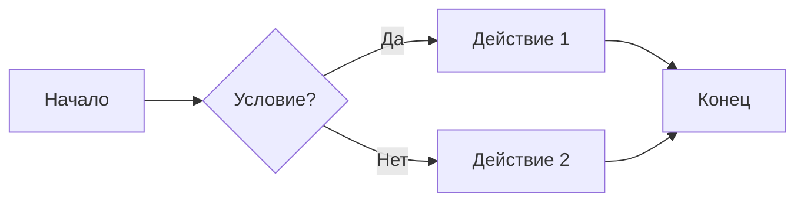
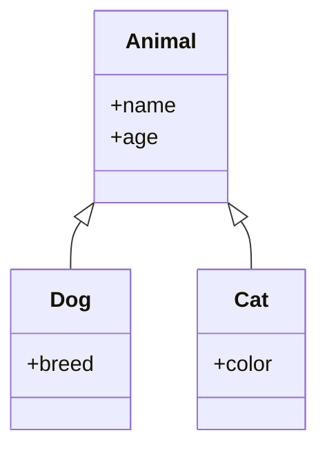
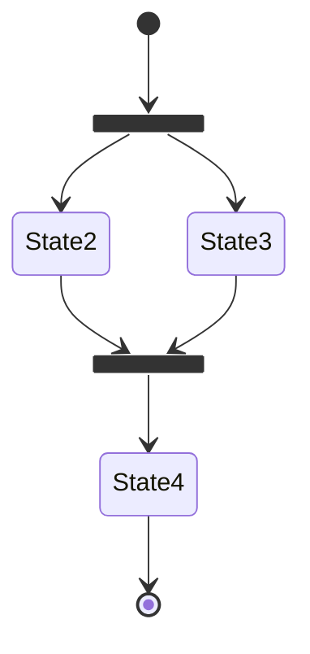
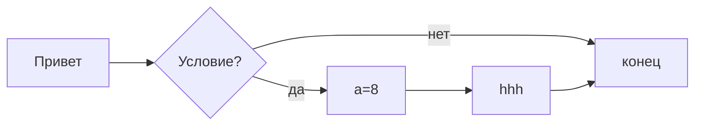
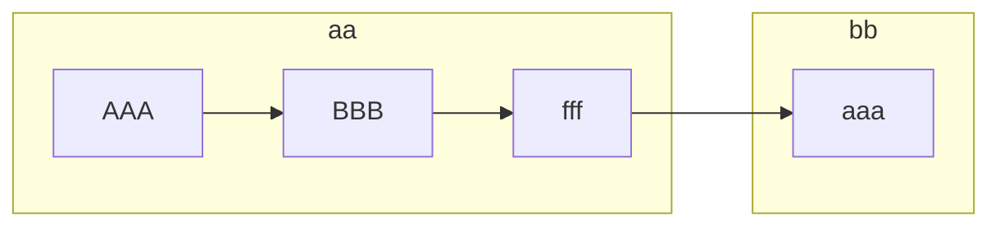

# podgotovka

$$
S = {1 \over 2} ah
$$

ааа

1. аоаоао<br>
   -акккк<br>
   -ккккк<br>
       1.аааааа<br>
3. гаоаоа<br>
4. рарарар<br>

- ршокаопа<br>
- рарарар<br>
- папапапап<br>


[Текст описания ](https://vk.com/dashka_pt)

|Заголовок 1| Заголовок 2| Заголовок 3|
|-----------|------------|------------|
|Ячейка 1| Ячейка 2| Ячейка 3|

```C#
Console.WriteLine("Hello world!");
```

> Цитата
> > Цитата

---
***
___

<table>
    <thead>
      <tr>
        <th rowspan="2">Поезд</th>
        <th rowspan="2">Маршрут</th>
        <th colspan="2">Отправление</th>
        <th colspan="2">Прибытие</th>
      </tr>
      <tr>
        <th>Станция</th>
        <th>Время</th>
        <th>Станция</th>
        <th>Время</th>
      </tr>
    </thead>
    <tbody>
      <tr>
        <td>Скорый поезд № 123</td>
        <td>Москва - Санкт-Петербург</td>
        <td rowspan="6">Москва (Курский вокзал)</td>
        <td>07:00</td>
        <td>Санкт-Петербург (Московский вокзал)</td>
        <td>15:00</td>
      </tr>
      <tr>
        <td>Электричка № 456</td>
        <td>Москва - Зеленоград</td>
        <td>07:15</td>
        <td>Зеленоград (Станция Зеленоград)</td>
        <td>08:15</td>
      </tr>
      <tr>
        <td>Скорый поезд № 789</td>
        <td>Москва - Казань</td>
        <td>07:30</td>
        <td>Казань (Казанский вокзал)</td>
        <td>16:00</td>
      </tr>
      <tr>
        <td>Скорый поезд № 101</td>
        <td>Москва - Нижний Новгород</td>
        <td>08:00</td>
        <td>Нижний Новгород (Московский вокзал)</td>
        <td>14:00</td>
      </tr>
      <tr>
        <td>Скорый поезд № 999</td>
        <td>Москва - Уренгой</td>
        <td>08:45</td>
        <td>Уренгой (Станция Уренгой)</td>
        <td>19:00</td>
      </tr>
      <tr>
        <td>Электричка № 321</td>
        <td>Москва - Серпухов</td>
        <td>09:00</td>
        <td>Серпухов (Станция Серпухов)</td>
        <td>10:00</td>
      </tr>
    </tbody>
  </table>


  <table>
     <tr>
        <td rowspan="2">ffff</td>
        <td>fff</td>
     </tr>
     <tr>
        <td></td>
     </tr>
     <tr>
        
     </tr>
  </table>

# fffff
[hfhfh](# fffff)








     


$$
h={1 \over 2} hf
$$






:smile:
